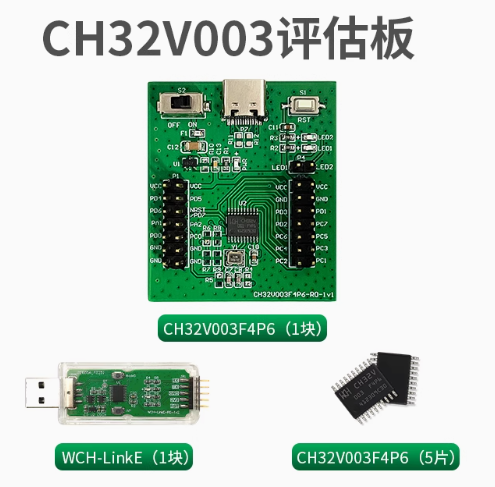
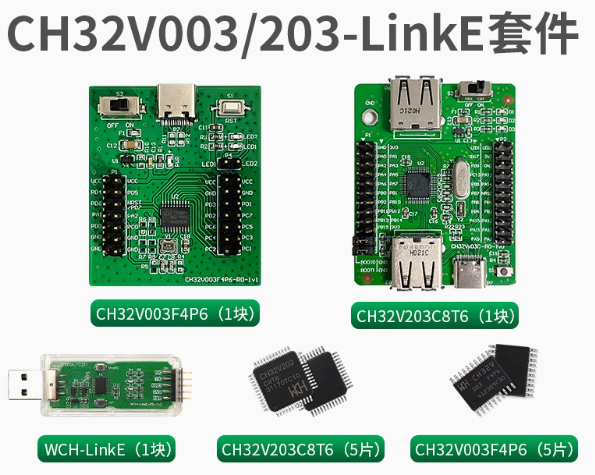
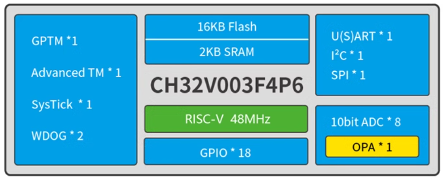
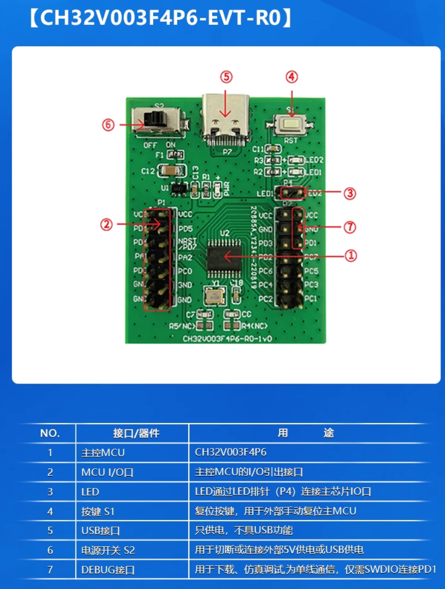
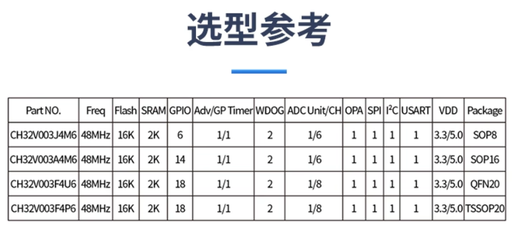
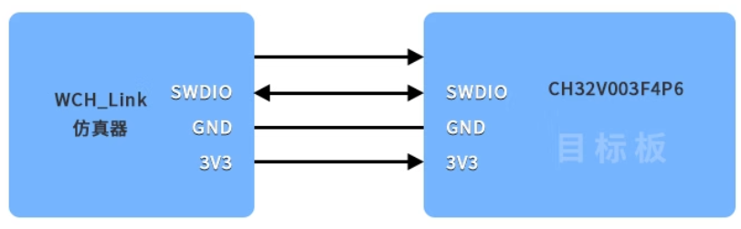

# CH32V003F4P6LinkE套件系列

## CH32V003  vs CH32V203

## CH32V003简介

CH32V003系列是基于青稞RISC-V2A内核设计的工业级通用微控制器，支持48MHz系统主频，具有宽压、单线调试、低功耗、超小封装等特点。CH32V003系列内置1组DMA控制器、1组10bit模数转换ADC、1组运放比较器、多组定时器以及标准通讯接口USART、IIC、SPI等。

特点:

* 青稞32位RISC-V2A处理器，支持2级中断嵌套
* 最高48MHz系统主频
* 2KB SRAM， 16KB Flash
* 供电电压:3.3/5V
* 多种低功耗模式:睡眠、待机
* 上/下电复位、可编程电压检测器
* 1组1路通用DMA控制器
* 1组运放比较器
* 1组10位ADC
* 1个16位高级定时器和1个16位通用定时器
* 2个看门狗定时器和1个32位系统时基定时器
* 1个USART接口、1组IIC接口、1组SPI接口
* 18个I/0口，映像一个外部中断
* 64位芯片ID
* 串行单线调试接口

## CH32V003使用

评估板可通过WCH-LinkE进行在线调试和下载SDI连接方式如下图：

* 12C-7/10bit地址模式/12C使用DMA/I2C接口操作EEPROM外设/12C使用PEC错误校验例程
* APP跳转内置IAP例程
* 独立看门狗例程
* OPA作电压跟随器输出例程
* 低功耗，睡眠模式/待机模式例程
* 获取System-HCLK-AHB1-AHB2时钟例程
* MCO引脚时钟输出例程
* SPI单线半双工/双线全双工/硬件NSS/使用CRC错误校验/使用DMA例程
* Systick中断例程
* 时钟源选择/互补输出和死区插入/外部触发同步启动两个定时器/输入捕获/单脉冲输出/输出比较/PWM输出/从模式/定时器同步模式/定时器使用DMA例程
* USART的DMA/半双工/硬件流控/中断/多处理器通信/轮询收发/串口打印调试例/同步例程
* 窗口看门狗例程

当采用SDI模式进行程序下载调试时，一般采用4线，即电源线VCC、地线GND、数据线SWDI0、时钟线SWCLK。

CH32V003F4P6的评估板在使用WCH-LinkE下载、调试时,为单线通信，仅需SWDIO连接PD1，不使用SWCLK。

提供例程

* ADC使用DMA采样/ADC 模拟看门狗/ADC自动注入模式/ADC间断模式/外部触发ADC转换例程
* 储存器到储存器模式/储存器到外设模式/外设到储存器模式例程
* 外部中断线例程
* FLASH的擦/读/写，以及快速编程
* GPIO例程

配套资料
* CH32V003数据手册:[CH32V003DS0.PDF](https://www.wch.cn/downloads/CH32V003DS0_PDF.html)
* CH32V003用户手册:[CH32FV2xV3xRM.PDF](https://www.wch.cn/downloads/CH32V003RM_PDF.html)
* CH32V003官方例程:[CH32V003EVT.ZIP](https://www.wch.cn/downloads/CH32V003EVT_ZIP.html)
* WCH-Link使用说明:https://www.wch.cn/products/WCH-Link.html
* MounRiverStudio_Linux_X64_V210 ：http://www.mounriver.com/download