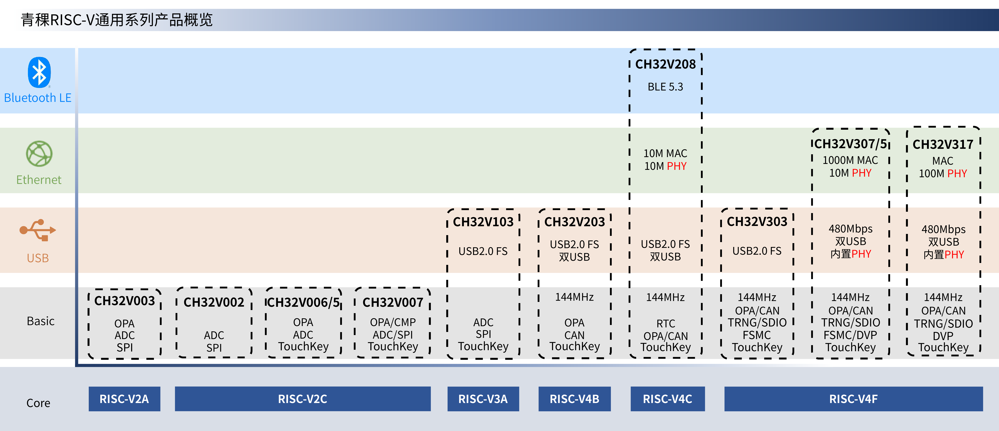

# 沁恒微电子

- 官网：https://www.wch.cn/
- WCH沁恒微电子官方店：https://shop137880236.taobao.com/

## RISC-V产品介绍

### RISC-V 产品系列

* RISC-V通用系列
* RISC-V特色应用系列
* RISC-V蓝牙无线系列
* RISC-V增强低功耗系列

## [RISC-V通用系列](https://www.wch.cn/products/productsCenter/mcuInterface?categoryId=70)

  

### 产品选型

| Part No.                                           | Freq   | Flash | SRAM | ADC Unit/CH | OPA | TouchKey | UART/SPI/IIC/IIS | CAN | USB2.0                         | Ethernet       | BLE | Other Features | VDD         | Package                                                   |
| -------------------------------------------------- | ------ | ----- | ---- | ----------- | --- | -------- | ---------------- | --- | ------------------------------ | -------------- | --- | -------------- | ----------- | --------------------------------------------------------- |
| [CH32V317](https://www.wch.cn/products/CH32V317.html) | 144MHz | 256K  | 64K  | 2/16        | 4   | 16       | 8/3/2/2          | 2   | 480Mbps H/D内置PHY``12Mbps OTG | 10M/100M PHY   | -   | DVP/SDIO       | 3.3/5.0     | LQFPF100/QFN68                                            |
| [CH32V307](https://www.wch.cn/products/CH32V307.html) | 144MHz | 256K  | 64K  | 2/16        | 4   | 16       | 8/3/2/2          | 2   | 480Mbps H/D内置PHY``12Mbps OTG | 1G MAC+10M PHY | -   | FSMC/DVP/SDIO  | 3.3/5.0     | LQFP100/QFN68/LQFP64M                                     |
| [CH32V305](https://www.wch.cn/products/CH32V307.html) | 144MHz | 128K  | 32K  | 2/16        | 4   | 16       | 5/3/2/2          | 2   | 480Mbps H/D内置PHY``12Mbps OTG | -              | -   | SDIO           | 3.3/5.0     | LQFP64M/LQFP48/QFN28/TSSOP20                              |
| [CH32V303](https://www.wch.cn/products/CH32V303.html) | 144MHz | 256K  | 64K  | 2/16        | 4   | 16       | 8/3/2/2          | 1   | 12Mbps H/D                     | -              | -   | FSMC/SDIO      | 3.3/5.0     | LQFP100/LQFP64M/LQFP48                                    |
| [CH32V208](https://www.wch.cn/products/CH32V208.html) | 144MHz | 128K  | 64K  | 1/16        | 2   | 16       | 4/2/2/-          | 1   | 12Mbps D+H/D                   | 10M PHY        | 5.3 | -              | 3.3/5.0     | QFN68/LQFP64M/QFN48/QFN28                                 |
| [CH32V203](https://www.wch.cn/products/CH32V203.html) | 144MHz | 128K  | 64K  | 1/16        | 2   | 16       | 4/2/2/-          | 1   | 12Mbps D+H/D                   | 10M PHY        | -   | -              | 3.3/5.0     | LQFP64M/LQFP48/QFN48X7/LQFP32``QFN28/QSOP28/QFN20/TSSOP20 |
| [CH32V103](https://www.wch.cn/products/CH32V103.html) | 80MHz  | 64K   | 20K  | 1/16        | -   | 16       | 3/2/2/-          | -   | 12Mbps H/D                     | -              | -   | -              | 3.3/5.0     | LQFP64M/LQFP48/QFN48X7                                    |
| [CH32V007](https://www.wch.cn/products/CH32V007.html) | 48MHz  | 65K   | 8K   | 1/8         | 1   | 8        | 2/1/1/-          | -   | -                              | -              | -   | SLTIM/CMP      | 2.5/3.3/5.0 | QFN32/QSOP24                                              |
| [CH32V006](https://www.wch.cn/products/CH32V006.html) | 48MHz  | 65K   | 8K   | 1/8         | 1   | 8        | 2/1/1/-          | -   | -                              | -              | -   | -              | 2.5/3.3/5.0 | QFN32/QSOP24/QFN20/TSSOP20/QFN20                          |
| [CH32V005](https://www.wch.cn/products/CH32V005.html) | 48MHz  | 32K   | 6K   | 1/8         | 1   | -        | 2/1/1/-          | -   | -                              | -              | -   | -              | 2.5/3.3/5.0 | QSOP24/QFN20/TSSOP20/QFN12                                |
| [CH32V004](https://www.wch.cn/products/CH32V004.html) | 48MHz  | 32K   | 6K   | 1/8         | -   | -        | 2/1/1/-          | -   | -                              | -              | -   | -              | 2.5/3.3/5.0 | QFN20/TSSOP20                                             |
| [CH32V003](https://www.wch.cn/products/CH32V003.html) | 48MHz  | 16K   | 2K   | 1/8         | 1   | -        | 1/1/1/-          | -   | -                              | -              | -   | -              | 3.3/5.0     | QFN20/TSSOP20/SOP16/SOP8                                  |
| [CH32V002](https://www.wch.cn/products/CH32V002.html) | 48MHz  | 16K   | 4K   | 1/8         | -   | -        | 1/1/1/-          | -   | -                              | -              | -   | -              | 2.5/3.3/5.0 | QFN20/TSSOP20/SOP16/QFN12/SOP8                            |
